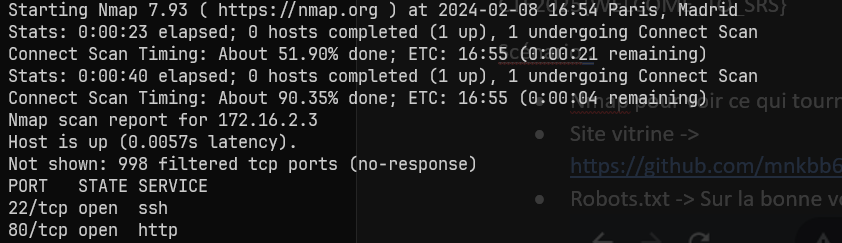
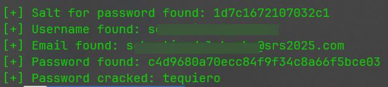
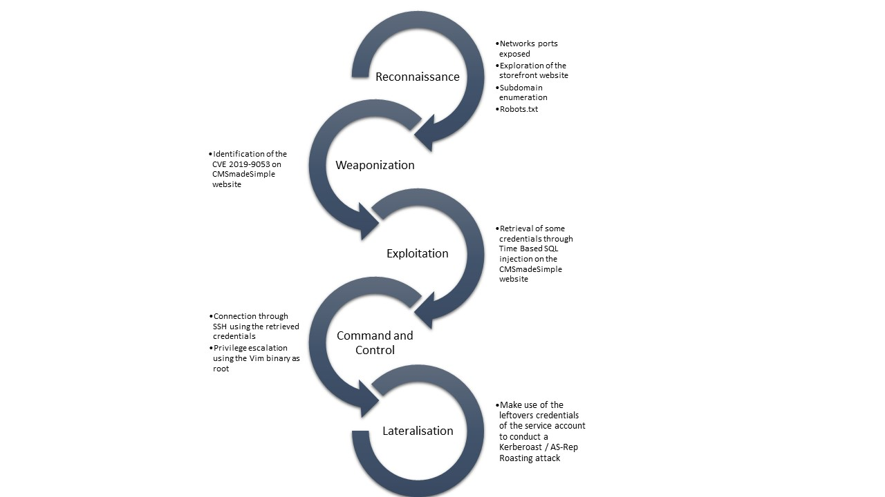
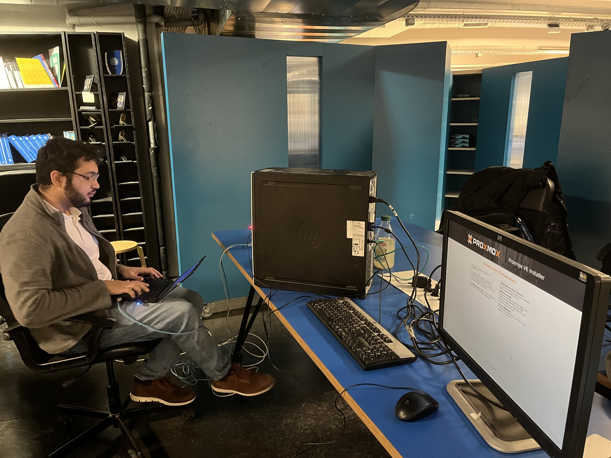

## Introduction

Here I am, finishing my degree in Security, Networks, and Systems ([SRS](https://srs.epita.fr/)) at EPITA engineering school. But before I leave, I wanted to create something that would inspire the next class of students for their joining the cybersecurity world. After a lot of thinking, I decided to create a Capture The Flag (CTF) challenge. Of course, I had no idea how to create a CTF challenge, but I was eager to learn and create something that would be fun and interesting for everyone. That being said, I had only a week to design and create everything.

Here is where my journey began. 🙂

## The idea

First, I needed to find an idea of how and what security breaches I wanted to integrate into the challenge. It needed to start from the basics and go up from there to make sure that everyone could participate. I knew in advance that some students would not know about cybersecurity whatsoever, and some of them would have participated in CTF challenges before. So, I needed to find a way to make it interesting for everyone.
²
After some brainstorming, I decided to start with a simple web page with a few things to look for (exposed ports on the machine, robots.txt file). 

Then, I stumbled across an [SQL injection flaw in the CMSmadeSimple web application](https://www.exploit-db.com/exploits/46635). I thought it would be a good idea to integrate it into the challenge as a subdomain web page. The participants would have to discover the subdomain through some subdomain brute-forcing. 

Then once the page is discovered, the SQL injection would reveal some credentials that would allow the participants to connect to the machine through SSH. From there, they would have to find a way to escalate their privileges with Vim being able to execute commands as root and then get the final flag.

To add some spice to the challenge, a friend of mine suggested that it would be interesting to add an optional part for the more advanced players with an Active Directory server. At first, I was a bit skeptical, but as he showed me that a service account could be registered in the Active Directory, I thought it would be a good idea to add it to the challenge. The participants would have to find a way to compromise the service account to get the flag and then escalate their rights to Domain Admin to get the final flag.

## Design and Development

I needed to have a solution that would make it easy to deploy this application with as little manual configuration as possible. It would also need to consume as little resources on the machines as possible. I then remembered that I had some courses about Linux administration (thanks Nemu ❤️), so I decided to use Ansible and Docker which will allow me to set up the environment in a few commands and deploy every docker container I needed. Great! I had a solution.

What was not bringing me joy, however, was the fact that the Active Directory server would have to be set up manually. Nothing too complicated, but a bit tedious.

The architecture would look something like this :

To host this architecture, I would need a server. There were plenty of computers in the laboratory that would do the trick. So I picked one up, added some RAM, and threw Proxmox on it. I had a bit of experience using Proxmox CE so that made the setup easier. After using it and putting every VM we needed it was sluggish and not responsive for the user and we were only two people to test it. I can only imagine 60 participants throwing SQL injection on this poor server. This issue was strange, as the VMs were not consuming a lot of resources, but the CPU of this server was pretty old (almost as old as me actually).  

I needed something better. I could have set up a cluster but it was too much for the remaining time I had. What I ended up doing, after some discussion with the administration, was providing 5 ESXis. That way, we just had to split the participants into little groups and every group could have its instance of the challenge! This was the time I thought again about the decision to go with Ansible to set everything up, I was pretty happy about it.

Once the ESXIs and the VPN access were provided, all that was left to do was to :

- Setup a two Docker containers for the storefront website and the CMSmadeSimple website, on a Debian instance and configure it
- Setup the Active Directory, registering the service account as well as some users that could be hacked using the Kerberoast attack

To simplify the process of configuring 5 instances of each VM, we took advantage of the “download VM” functionality. This functionality allowed us to set up everything once and then download each VM, upload it to the new ESXi, change the IP address and the DNS and that’s it! Pretty neat. 🙂

## Kill Chain

I know this article goes on and on, but to simplify it here is an overview of the kill chain from the storefront website to the Domain Administrator.

## Conclusion

Creating this CTF challenge was a journey of discovery. It was a hands-on opportunity to apply what I had learned throughout my degree and contribute at the same time. It has been a rough week, but I am proud of the result. I hope that the next promotion of students enjoyed it as much as I did creating it.

You can find the code of the challenge on my [GitHub](https://github.com/theolebever/CTF-2025-SRS).

## Acknowledgments

Special thanks to [Marius Andre](https://www.linkedin.com/in/marius-andr%C3%A9/) and [Mehdi Fidahoussen](https://www.linkedin.com/in/mehdi-f/) for their support and their technical help in the creation of this CTF challenge. Their contributions were instrumental in overcoming the challenges encountered during the development process. 

Thank you to all the SRS students who joined to animate the challenge and helped the participants when they were stuck. 😊