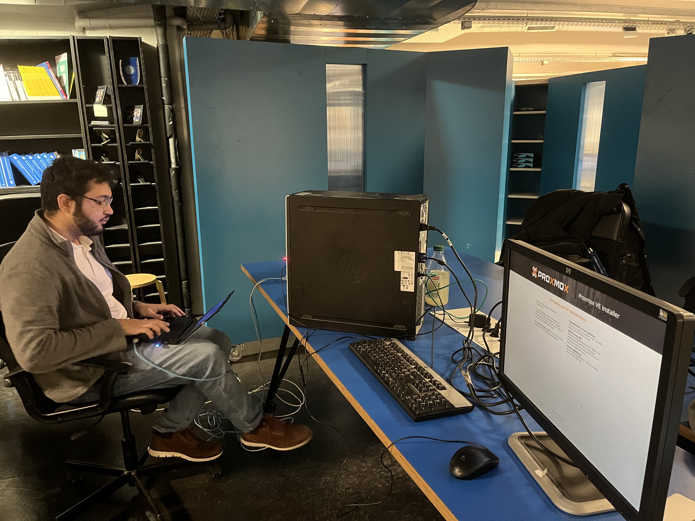

# Introduction

Here I am, finishing my degree in Security, Networks and System ([SRS](https://srs.epita.fr/)) at EPITA engineering school. But before I leave, I wanted to create something that would inspire the next promotion of students for their joining into the cybersecurity world. After much thinking, I decided to create a Capture The Flag (CTF) challenge for the next promotion of students. Of course, I had no idea how to create a CTF challenge, but I was eager to learn and create something that would be fun and interesting for everyone. That being said, I had only a week to design and create everything. 

Here is where my journey began. 🙂

# The idea

First, I needed to find an idea of how and what security breaches I wanted to integrate into the challenge. It needed to start from the basics and go up from there to make sure that everyone could participate. I knew in advance that some students would have no knowledge of cybersecurity whatsoever, and some of them would have participated in CTF challenges before. So, I needed to find a way to make it interesting for everyone.

After some brainstorming, I decided to start from a simple web page with a few things to look for (exposed ports on the machine, robots.txt file). Then, I stumbled across an [SQL injection flaw in the CMSmadeSimple web application](https://www.exploit-db.com/exploits/46635). I thought it would be a good idea to integrate it into the challenge as a subdomain web page. The participants would have to discover the subdomain through some subdomain bruteforcing. Then once the page discovered, the SQL injection would reveal some credentials that would allow the participants to connect to the machine through SSH. From there, they would have to find a way to escalate their privileges with vim being able to execute commands as root and then get the final flag.

To add some spice to the challenge, a friend of mine suggested that it would be interesting to add an optional part for the more advanced players with an Active Directory server. At first I was a bit skeptical, but as he showed me that a service account could be registered in the Active Directory, I thought it would be a good idea to add it to the challenge. The participants would have to find a way to compromise the service account to get the flag and then escalate their rights to Domain Admin to get the final flag.

# Design and Development

I needed to have a solution that would make it easy to deploy this application with as little manual configuration as possible. It would also need to consume as little as ressource on the machines as possible. I then remembered that I had some courses about Linux administration (thanks Nemu ❤️), so I decided to use Ansible and Docker which will allow me to set up the environment in a few commands and deploy every docker container I needed. Great ! I had my solution.

What was not bringing me joy however, was the fact that the Active Directory server would have to be set up manually. Nothing too complicated, but a bit tideous.

The architecture would look something like this :

# Conclusion

Creating this CTF challenge was a journey of discovery, not only for the prospective participants but for myself as well. It was a hands-on opportunity to apply what I had learned throughout my degree and contribute at the same time. It has been a rough week, but I am proud of the result. I hope that the next promotion of students enjoyed it as much as I did creating it.

# Acknowledgments

I would like to thank [Marius Andre](https://www.linkedin.com/in/marius-andr%C3%A9/) and [Mehdi Fidahoussen](https://www.linkedin.com/in/mehdi-f/) for their support and their technical help in the creation of this CTF challenge. God knows it has been a long night, the night before the challenge. 😅

And thank you to all the SRS students who joined to animate the challenge and helped the participants when they were stuck. 😊

